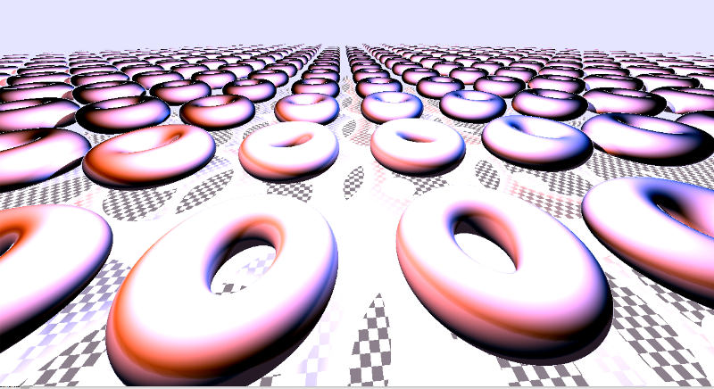

# Graphics : one example of tiny Assembly OpenGL Code
---

---

## Context

It's an attempt for Revision Party 2017 to create a compo for the "wild" category.

I tried to shrink my code to 1K... but i can't get over 1.3 K damn it ! 

## Technical details

It's a pure fragment shader, build from different source.
The main one is the incredible shadertoy ! [Shader Toy](https://www.shadertoy.com/)

Second, ALL the precious tutorial from
Inigo Quilez is my GOD ! [Inigo web site](http://www.iquilezles.org/apps/index.htm)

and some google find :

1 - [Jamie Wong](http://jamie-wong.com/2016/07/15/ray-marching-signed-distance-functions/)

2 - [9bitscience](http://9bitscience.blogspot.fr/2013/07/raymarching-distance-fields_14.html)

3 - the lib from mercury group : [Mercury](http://mercury.sexy/hg_sdf/)

oh find a new one ...

4 - [michael](http://www.michaelwalczyk.com/blog/2017/5/25/ray-marching)

Third, the paper about sphere tracing an SDF function :

[john C. Hart](http://mathinfo.univ-reims.fr/IMG/pdf/hart94sphere.pdf)

There is an enhanced version out there one the web ... but the link is dead ...

The fragment itself is :

	- an "infinite" torus done with SDF function an modulo operation
	- two different sources of light
	- shadow done "for free" during the ray marching process
	
The code is purely assembly :

	- some tricks find from molten core 1k [Molten core on pouet](http://www.pouet.net/prod.php?which=64235)
	
	- some tweaks from me ... because i can't pass time through the "color trick"
	- shrink code in the fragment is done with "classical" #define and function with short name ;-) (yes one letter is short)
	- to shrink everything, i use the mighty Crinkler [Crinkler website](http://www.crinkler.net/)
	
The result is weird sometimes ... i mean, i played so much with the fragment shader to gain bytes,
i can't even read the code by now ! ouch ...

anyway ... hope someone can find it useful

see yah

idle

